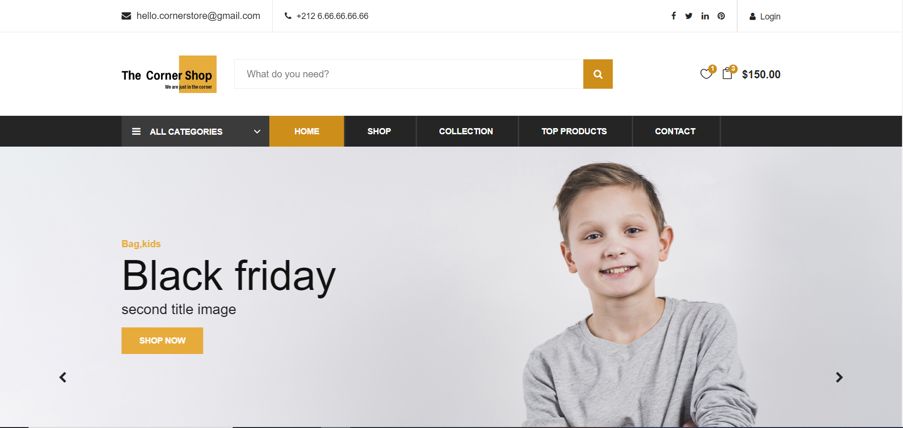
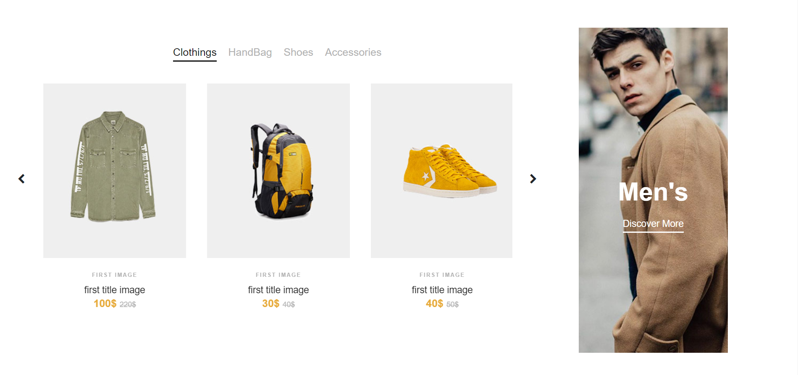
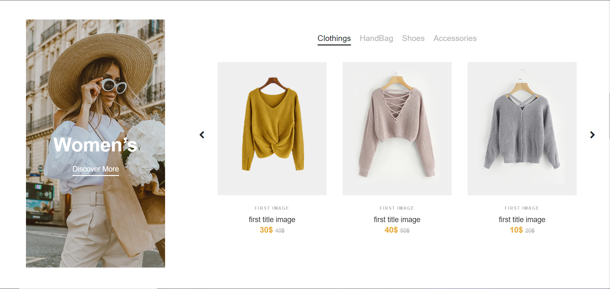
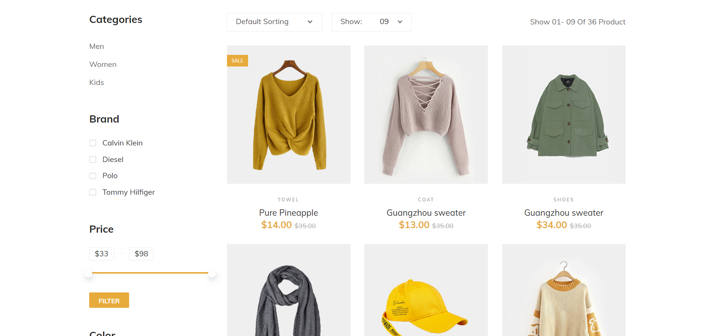

# Corner Store

This project was generated with [Angular CLI](https://github.com/angular/angular-cli) version 8.3.17.

## Start

Run `npm install` to install all requirements client repo to intall angular project requirements

## Development Spring boot

Run corner store spring boot server for.default port: `http://localhost:8015/`.

## Development Client server

Run `npm server`. Navigate to `http://localhost:4200/`. server changes will automatically reload in the in the browser

## For dev

font-end folder is the Angular Project
back-end folder is the Spring boot 

## Preview:

## API

API documentation is in `http://localhost:8015/swagger-ui.html`

## TODO

Backend: 

* Add Piece Auto inc_id depends on the piece type.
* test the piece and ligne_de_command controllers.

Frontend:

* complete necessary models and services.
* add contact-page.
* Add content and some pages

Performance: 

* minimize images and fonts
* add LazyLoading

All the documentations needed are inside the files

## Athors: 
* **Alae Es-saki**  - [Alaeessaki](https://github.com/alaeessaki)
* **HAKOUM Reda** 
* **TAGOULA Issam**
* **CHRAYHA Abdelatti** 

## Licence & Copyright
© ES-SAKI Alae, HAKOUM Reda, TAGOULA Issam, CHRAYHA Abdelatti.

Licensed under the [MIT Licence](LICENSE)

